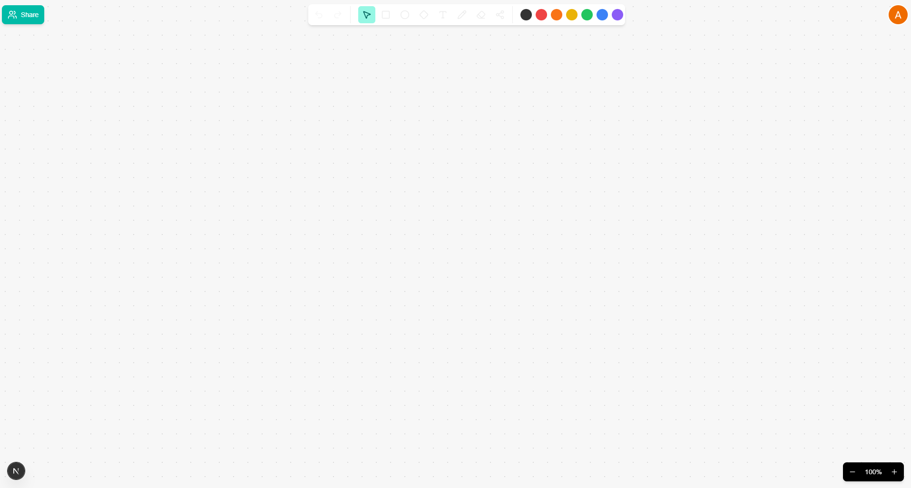

# Synapse
A real-time, collaborative whiteboard application built from the ground up to demonstrate mastery of modern full-stack technologies. Inspired by industry leaders like Miro and FigJam.

 
---

## Vision
To create a web-based whiteboard application that offers a frictionless, real-time collaborative experience. Synapse serves as a blueprint for building highly performant, state-synchronized applications.

---

## Core Features
- [x] **Secure User Authentication:** Sign-in with Google & GitHub using NextAuth.js.
- [x] **Full Board Management:** A complete dashboard where users can create, join by name, see a list of their boards, rename, and delete them.
- [x] **Real-Time Collaboration Engine:**
    - [x] **Live Cursors:** See the cursors of other active users on the board.
    - [x] **Presence Indicators:** View the avatars of all users currently on a board.
    - [x] **Instant State Sync:** All actions are instantly reflected across all connected clients with minimal latency.
- [x] **Complete Whiteboard Toolset:**
    - [x] **Shapes:** Create and manipulate rectangles, circles, and diamonds.
    - [x] **Content Tools:** Add sticky notes with real-time text editing and a dedicated free-form Text tool.
    - [x] **Drawing:** A freehand Pen tool for quick sketches.
    - [x] **Smart Connectors:** Draw lines between shapes that intelligently snap to the nearest edges.
    - [x] **Eraser:** An object eraser to easily delete any shape.
- [x] **Productivity Tools:**
    - [x] **Undo/Redo System:** A full history stack allows users to step backward and forward through their actions.
    - [x] **Infinite Canvas:** A pannable and zoomable canvas for an infinitely expandable workspace.
- [x] **Sharing & Permissions System:**
    - [x] Invite other registered users to a board by email.
    - [x] Manage member roles (Owner, Editor, Viewer).
    - [x] Enforce read-only access for "Viewers" on both the frontend and backend.

---

## Tech Stack
* **Framework:** Next.js (App Router)
* **Frontend:** React, TypeScript, Tailwind CSS
* **Canvas Rendering:** `react-konva`
* **State Management:** Zustand (with a history stack for Undo/Redo)
* **Real-Time Layer:** Node.js with the `ws` library for WebSockets
* **Database & Auth Backend:** Firebase Firestore with the `Firebase Admin SDK`
* **Authentication:** NextAuth.js (v5) with `@auth/firebase-adapter`

---

## Getting Started (Local Development)
Follow these instructions to set up and run the project on your local machine.

### 1. Prerequisites
* Node.js (v18 or later)
* npm

### 2. Installation
Clone the repository and install all dependencies from the root directory:

```bash
git clone https://github.com/your-username/synapse.git
cd synapse
npm install
```

### 3. Firebase Setup (Crucial)
This project requires a Firebase project for authentication and the database.

1. Go to the Firebase Console and create a new project.
2. In your new project, navigate to **Build > Firestore Database** and create a database. Start in **test mode** for now.
3. Go to **Project settings** (the gear icon) > **Service accounts**.
4. Click **"Generate new private key"**. A JSON file will be downloaded.
5. Rename this file to `serviceAccountKey.json` and place it inside the `packages/firebase-admin` directory.
6. Navigate back to **Firestore Database > Indexes**. You must manually create two indexes for the queries to work:
   * **Index 1 (For the board list):**
      * **Collection:** `boards`
      * **Fields:** `memberIds` (Array-contains), `createdAt` (Descending)
   * **Index 2 (For inviting users):**
      * **Collection:** `users`
      * **Fields:** `email` (Ascending)
   * Wait for both indexes to finish building and show a status of **Enabled**.

### 4. Environment Variables
1. Navigate to the client app: `cd apps/client`
2. Create a new file named `.env.local`
3. Add the following variables, filling in your own keys from the Google Cloud Console and GitHub OAuth Apps:

```bash
# Generate a secret using `openssl rand -hex 32` in your terminal
AUTH_SECRET="YOUR_AUTH_SECRET"
AUTH_URL="http://localhost:3000"

# Google OAuth Credentials
AUTH_GOOGLE_ID="YOUR_GOOGLE_CLIENT_ID"
AUTH_GOOGLE_SECRET="YOUR_GOOGLE_CLIENT_SECRET"

# GitHub OAuth Credentials
AUTH_GITHUB_ID="YOUR_GITHUB_CLIENT_ID"
AUTH_GITHUB_SECRET="YOUR_GITHUB_CLIENT_SECRET"

# WebSocket Server URL for the client to connect to
NEXT_PUBLIC_WEBSOCKET_URL="ws://localhost:8080"
```

### 5. Run the Development Servers
From the **root directory** of the project, run the single `dev` script. This will start both the Next.js frontend and the Node.js backend concurrently.

```bash
npm run dev
```